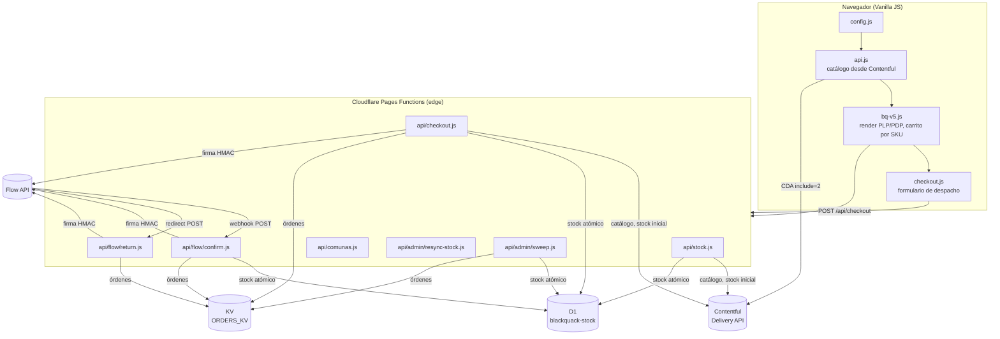
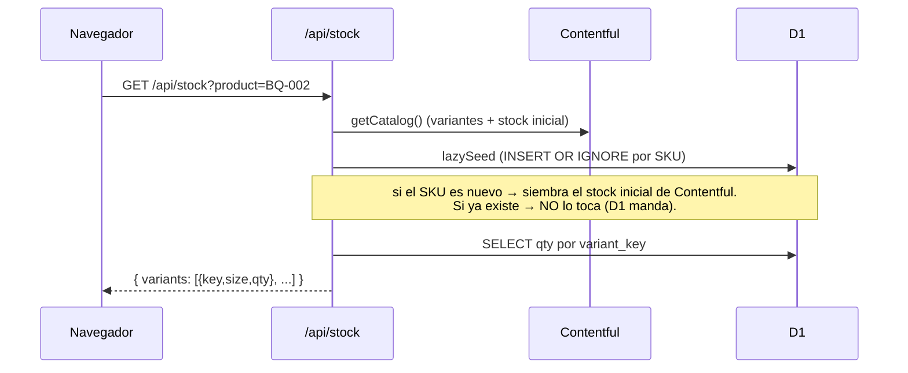
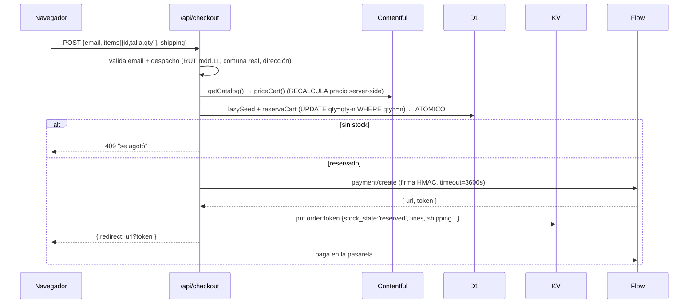

# BlackQuack — Arquitectura y guía técnica

> Documento para auditoría por desarrolladores humanos y por otras IA.
> Describe el stack, la arquitectura, los flujos y las decisiones de diseño del
> ecommerce JAMstack de BlackQuack.

**Estado:** POC funcional, en despliegue a producción (Cloudflare Pages).
**Última actualización:** julio 2026.

---

## 1. Resumen

BlackQuack es un ecommerce ultraligero para una marca de animación análoga
(catálogo acotado, ~15 productos). El objetivo de diseño es **cero build step en
el frontend** (HTML + Vanilla JS + variables CSS) y **lógica transaccional en el
edge** (Cloudflare Pages Functions).

Tres servicios externos:

| Servicio | Rol |
|---|---|
| **Contentful** (Headless CMS) | Catálogo: productos, variantes, imágenes, textos, stock **inicial**. Lo administra gente no técnica. |
| **Cloudflare D1** (SQLite en el edge) | Verdad del **stock en vivo**: decremento atómico, reservas. |
| **Cloudflare KV** | Registro de órdenes (estado de pago, datos de despacho). |
| **Flow** (pasarela chilena) | Procesa los pagos (Webpay, etc.) vía firma HMAC. |

Despacho: **"Por Pagar"** (Starken o Chilexpress) — el cliente paga el envío al
recibir, así que Flow solo cobra el valor de los productos.

---

## 2. Stack

- **Frontend:** HTML5 estático + Vanilla JS (sin framework ni bundler) + CSS con
  custom properties. Íconos vía lucide (CDN). Rich Text vía
  `@contentful/rich-text-html-renderer` cargado con `import()` dinámico desde
  esm.sh (no hay paso de compilación).
- **Backend:** Cloudflare **Pages Functions** (runtime Workers) en `functions/`.
- **Datos:** Contentful Delivery API (lectura), Cloudflare **D1** (SQL
  transaccional), Cloudflare **KV** (órdenes).
- **Pagos:** Flow (`flow.cl`), API REST con firma HMAC-SHA256.
- **Hosting/CI:** Cloudflare Pages conectado al repo de GitHub; push a `main`
  despliega producción, push a otra rama crea un Preview.

---

## 3. Arquitectura de alto nivel



**Principio clave:** el navegador nunca calcula precios ni ve el `secretKey` de
Flow. El precio se **recalcula en el servidor** contra Contentful, y la firma
HMAC se hace **server-side**. El frontend solo envía `{id, talla/color/diseño,
qty}` + datos de despacho.

---

## 4. Estructura del repositorio

```
├── index.html, tienda.html, producto.html, talleres.html,
│   nosotros.html, labs.html, contacto.html, gracias.html   # páginas públicas
├── admin.html                                              # panel admin (no enlazado)
├── css/bq-v5.css                                           # todo el CSS (design system)
├── js/
│   ├── config.js        # window.BQ_CONFIG (space id + CDA token públicos)
│   ├── api.js           # fetchProducts(): Contentful → objetos + Rich Text→HTML
│   ├── bq-v5.js         # chrome (nav/footer/cart), PLP, PDP, carrito por SKU, showcase
│   └── checkout.js      # modal de despacho, validación cliente, POST /api/checkout
├── functions/                                              # Cloudflare Pages Functions
│   ├── _lib/
│   │   ├── flow.js      # firma HMAC, flowPost/flowGet, flowBase (sandbox/prod)
│   │   ├── catalog.js   # getCatalog() desde Contentful, priceCart(), buildSubject()
│   │   ├── stock.js     # D1: variantKey, lazySeed, reserve/release/commit, resync
│   │   ├── shipping.js  # validación RUT (mód. 11), teléfono, comuna
│   │   └── comunas.js   # 16 regiones · 346 comunas (fuente de verdad server)
│   └── api/
│       ├── stock.js          # GET  /api/stock?product=ID
│       ├── comunas.js        # GET  /api/comunas
│       ├── checkout.js       # POST /api/checkout  (reserva + crea pago Flow)
│       ├── flow/confirm.js   # POST /api/flow/confirm  (webhook: fuente de verdad del pago)
│       ├── flow/return.js    # POST /api/flow/return   (aterrizaje del navegador)
│       └── admin/
│           ├── resync-stock.js # POST /api/admin/resync-stock  (reabastecer D1 desde Contentful)
│           └── sweep.js        # POST /api/admin/sweep         (liberar reservas abandonadas)
├── schema.sql           # DDL de D1 (tablas stock, stock_ledger)
├── seed.sql             # siembra de ejemplo (opcional; el lazy-seed la reemplaza)
├── wrangler.toml        # binding D1 para local/CLI (producción se ata en el panel)
├── .dev.vars            # secretos LOCALES (gitignored) — SIEMPRE sandbox
├── .dev.vars.example    # plantilla versionada (sin valores)
└── .gitignore
```

---

## 5. Modelo de datos

### 5.1 Contentful (catálogo + stock inicial)

Content type **`product`** (campo `id` es el displayField, ej. `BQ-001`):

| Campo (ID real) | Tipo | Notas |
|---|---|---|
| `id` | Symbol | SKU visible, ej. `BQ-002` |
| `product_title` | Symbol | |
| `descripcin` | Text | **Sin tilde** — Contentful la quitó al autogenerar el ID |
| `category` | Symbol | |
| `price` | Integer | CLP entero; precio del producto simple / fallback |
| `stock` | Integer | Stock inicial **global** (productos simples) |
| `image`, `image_views` | Asset / Array | Imágenes; redimensionadas con la Images API |
| `variants` | Array→Link | Referencias a `productVariant` |
| `details` | RichText | Bloque "detalles" → se renderiza a HTML |

Content type **`productVariant`**:

| Campo | Tipo | Notas |
|---|---|---|
| `size`, `color`, `design` | Symbol | Ejes de variación (opcionales) |
| `stock` | Integer | Stock **inicial** de la variante |
| `price` | Integer | Precio por variante (cae al del producto si falta) |

### 5.2 Cloudflare D1 (`blackquack-stock`) — stock en vivo

Ver `schema.sql`:

```sql
CREATE TABLE stock (
  product_id  TEXT NOT NULL,
  variant_key TEXT NOT NULL DEFAULT '',   -- '' = producto sin variantes
  size, color, design TEXT,               -- display
  qty         INTEGER NOT NULL DEFAULT 0 CHECK (qty >= 0),
  seeded_from TEXT, updated_at TEXT,
  PRIMARY KEY (product_id, variant_key)
);
CREATE TABLE stock_ledger (               -- bitácora de movimientos
  id INTEGER PRIMARY KEY AUTOINCREMENT,
  product_id, variant_key TEXT,
  delta INTEGER, reason TEXT,             -- seed|reserve|release|commit|restock
  ref TEXT, created_at TEXT               -- ref = commerceOrder
);
```

**`variant_key`** es la clave canónica de la variante, construida idéntica en el
cliente (`js/bq-v5.js`) y el servidor (`functions/_lib/stock.js`):
`size:m|color:negro|design:x` (orden fijo, normalizado sin tildes/minúsculas).
Producto simple → `''`. El SKU efectivo es `(product_id, variant_key)`.

### 5.3 Cloudflare KV (`ORDERS_KV`) — órdenes

Clave `order:<flowToken>` → JSON:

```jsonc
{
  "commerceOrder": "BQ-XXXX", "flowOrder": 123, "email": "...",
  "amount": 13990, "lines": [{ "id","key","qty","unit_price", ... }],
  "shipping": { "nombre","rut","telefono","direccion","comuna","region",
                "courier":"Starken / Chilexpress","modalidad":"Por Pagar" },
  "status": "pending|paid|rejected|canceled|abandoned",
  "stock_state": "reserved|committed|released",   // idempotencia del stock
  "created_at": "...", "confirmed_at": "..."
}
```

---

## 6. Flujos principales

### 6.1 Render del catálogo (frontend)

`js/api.js` → `fetchProducts()` pega a la Contentful Delivery API con
`include=2` (resuelve `variants` y assets en una llamada), mapea a objetos
planos, redimensiona imágenes (webp) y convierte el Rich Text `details` a HTML.
`js/bq-v5.js` normaliza y renderiza PLP (grilla) y PDP (galería + panel sticky +
acordeón de detalles). Fallback a `products.json` si Contentful falla.

### 6.2 Stock híbrido (Contentful → D1) con lazy-seed



**Contentful = stock inicial. D1 = stock en vivo.** Una vez sembrado un SKU, D1
es la verdad; editar el stock en Contentful **no** se refleja solo → se
reabastece con `/api/admin/resync-stock` (ver §8).

### 6.3 Checkout y pago (el corazón)



Puntos críticos:
- **Reserva atómica antes de crear el pago:** `UPDATE stock SET qty=qty-n WHERE
  qty>=n` — dos compras simultáneas de la última unidad no pueden ganar ambas
  (la segunda afecta 0 filas → 409). Esto **impide la sobreventa**.
- Si Flow falla tras reservar → se **libera** la reserva (compensación).
- El precio del carrito se recalcula server-side; el cliente nunca lo fija.
- `timeout: 3600` en la orden Flow hace determinista el abandono (ver sweeper).

### 6.4 Confirmación del pago (webhook) — fuente de verdad

```mermaid
sequenceDiagram
  participant F as Flow
  participant CN as /api/flow/confirm
  participant D1 as D1
  participant KV as KV
  F->>CN: POST {token}   (servidor-a-servidor)
  CN->>F: payment/getStatus(token)   (el token NO es prueba de pago)
  alt status = PAGADA (2)
    CN->>D1: commitCart (deja rastro; el stock ya se descontó al reservar)
    CN->>KV: order.stock_state = 'committed', status='paid'
  else RECHAZADA/ANULADA (3/4)
    CN->>D1: releaseCart (devuelve el stock)
    CN->>KV: order.stock_state = 'released'
  end
  CN-->>F: 200 (si falla → 500 para que Flow reintente)
```

- `confirm` es la **fuente de verdad** del pedido (corre aunque el cliente cierre
  el navegador). `return` (`/api/flow/return`) es solo presentación: Flow hace
  **POST** al navegador → responde **303** a `gracias.html?status=...`.
- Idempotencia vía `stock_state` (solo transiciona desde `reserved`).

### 6.5 Estados del stock (máquina)

```
reserved --(pago OK)--> committed
reserved --(rechazo/anulación/abandono)--> released
```

---

## 7. Seguridad

| Aspecto | Cómo se maneja |
|---|---|
| **Flow secretKey** | Solo en Cloudflare Secrets (encriptado) y `.dev.vars` local (gitignored). **Nunca** llega al navegador. Toda la firma HMAC es server-side (`functions/_lib/flow.js`). |
| **Firma HMAC** | Params ordenados alfabéticamente, `nombre+valor` sin separador, HMAC-SHA256 hex, `s` excluido del string. Validado contra Flow real (sandbox y prod). |
| **Precio** | Recalculado en el servidor contra Contentful (`priceCart`). El browser no puede adulterarlo. |
| **Contentful CDA token** | Es de **solo lectura** y público por diseño (viaja al navegador). No es un secreto. |
| **Sobreventa** | Imposible por el `UPDATE ... WHERE qty>=n` atómico de D1. |
| **`FLOW_SANDBOX`** | Obligatoria (`"0"`/`"1"`); si falta, el checkout se **bloquea** en vez de asumir producción. |
| **Endpoints admin** | Protegidos por `ADMIN_RESYNC_SECRET` (header `x-admin-secret` o `?secret=`), comparación de tiempo constante. Nivel "sprint" — GET con secreto en URL puede filtrarse en logs. |
| **Datos personales** | RUT/dirección/teléfono se guardan en KV, **no** se envían a Flow (Flow solo recibe items + comuna). |

**Puntos de auditoría / mejoras pendientes:**
1. El `secretKey` de producción estuvo brevemente en `.dev.vars.example` y en el
   historial de chat durante el desarrollo → **rotarlo** en el panel de Flow.
2. `ADMIN_RESYNC_SECRET` es autenticación básica; para más robustez, mover a
   header-only y/o firmar las requests.
3. El `.dev.vars` local debe permanecer SIEMPRE en sandbox (regla operativa).

---

## 8. Herramientas de administración (`admin.html`, no enlazada)

Protegidas por `ADMIN_RESYNC_SECRET`:

- **`/api/admin/resync-stock`** — reabastecimiento autoritativo: lee Contentful
  en vivo (sin caché) y **machaca** `qty` en D1 con el stock que el admin acaba
  de publicar (upsert + `stock_ledger` reason `restock`). Necesario porque D1
  manda una vez sembrado. **Destructivo respecto a reservas en vuelo** → correr
  cuando no haya pagos a medio camino.
- **`/api/admin/sweep`** — libera reservas **abandonadas**: recorre las órdenes
  `reserved` vencidas, consulta Flow (`getStatus`) y libera solo las **no
  pagadas** (si Flow dice pagada, hace `commit` como red de seguridad). Cloudflare
  Pages **no tiene cron** → se dispara con un cron externo (cron-job.org / GitHub
  Actions) haciendo POST cada 15-30 min, o a mano desde `admin.html`.

---

## 9. Entorno y despliegue (Cloudflare Pages)

### Variables de entorno (por ámbito: **Production** y **Preview**)

| Variable | Tipo | Production | Preview / local |
|---|---|---|---|
| `FLOW_API_KEY` | Secret | Producción | Sandbox |
| `FLOW_SECRET_KEY` | Secret | Producción | Sandbox |
| `FLOW_SANDBOX` | Plaintext | `0` | `1` |
| `CONTENTFUL_SPACE_ID` | Plaintext | `jsyka3qmf5vm` | igual |
| `CONTENTFUL_ACCESS_TOKEN` | Plaintext | CDA (solo lectura) | igual |
| `CONTENTFUL_ENVIRONMENT` | Plaintext | `master` | igual |
| `ADMIN_RESYNC_SECRET` | Secret | aleatorio | aleatorio |

**Regla de oro:** `FLOW_SANDBOX=0` va con llaves de **producción**;
`FLOW_SANDBOX=1` con llaves de **sandbox**. Nunca se cruzan (Flow rechaza el
apiKey del ambiente equivocado). La **rama decide el ambiente**: `main` →
Production (dinero real), otras ramas → Preview (sandbox).

### Bindings (panel → Settings → Functions)

- KV namespace: `ORDERS_KV` → tu namespace.
- D1 database: `ORDERS_DB` → `blackquack-stock`.

El `database_id` en `wrangler.toml` es solo para local/CLI; en producción manda
el binding del panel.

### Esquema de D1 en producción (una vez)

```bash
npx wrangler d1 execute blackquack-stock --remote --file=schema.sql
```

El stock se puebla solo (lazy-seed) al leer cada producto por primera vez.

---

## 10. Desarrollo local

```bash
# .dev.vars con llaves SANDBOX + FLOW_SANDBOX=1
npx wrangler pages dev . --kv ORDERS_KV
# (usa el binding D1 del wrangler.toml; aplica el esquema local si hace falta:)
npx wrangler d1 execute blackquack-stock --local --file=schema.sql
```

Para pruebas de solo-frontend (sin Functions), `python3 -m http.server` sirve;
el formulario usa un **fallback embebido de comunas** en `checkout.js` cuando
`/api/comunas` no existe, y el stock cae al valor inicial de Contentful.

---

## 11. Limitaciones conocidas / pendientes

1. **Restock:** editar stock en Contentful no se refleja tras el primer seed →
   usar `/api/admin/resync-stock`.
2. **Sweeper:** requiere un cron externo (Pages no tiene cron nativo).
3. **Productos simples sin `stock` global** en Contentful → aparecen en 0
   (no comprables) hasta que se les asigne stock.
4. **Rich Text** depende de esm.sh en runtime (degradación elegante si falla).
5. **Comunas embebidas** en `checkout.js` son un fallback: mantener sincronizado
   con `functions/_lib/comunas.js` si cambia.
6. El **webhook `confirm`** solo se prueba de verdad desplegado (Flow no alcanza
   `localhost`).

---

## 12. Cómo auditar rápido

- **¿Se puede sobrevender?** Revisar `reserveLine` en `functions/_lib/stock.js`
  (el `WHERE qty >= ?` es la garantía).
- **¿El precio es manipulable?** Revisar `priceCart` en `functions/_lib/catalog.js`
  (ignora cualquier precio del cliente).
- **¿El secreto de Flow llega al cliente?** `grep -rn "FLOW_SECRET" js/ *.html`
  debe dar 0 usos reales.
- **¿La firma HMAC es correcta?** `signParams` en `functions/_lib/flow.js`;
  verificable contra Flow con `payment/getStatus` (read-only, no cobra).
- **¿Idempotencia de pagos?** `stock_state` en `flow/confirm.js` (solo actúa
  desde `reserved`).
