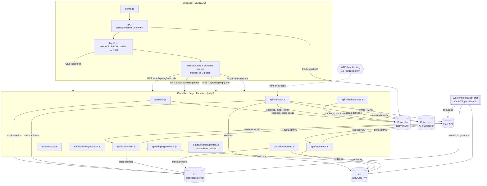
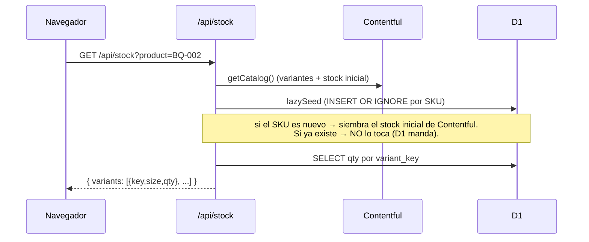
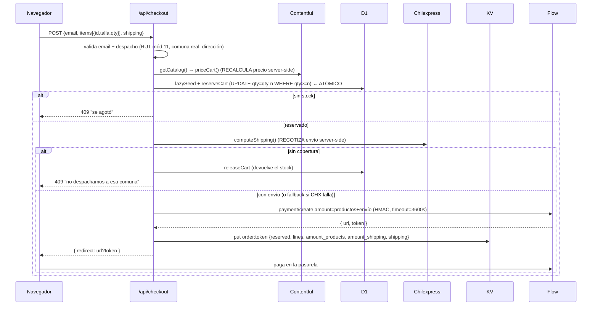
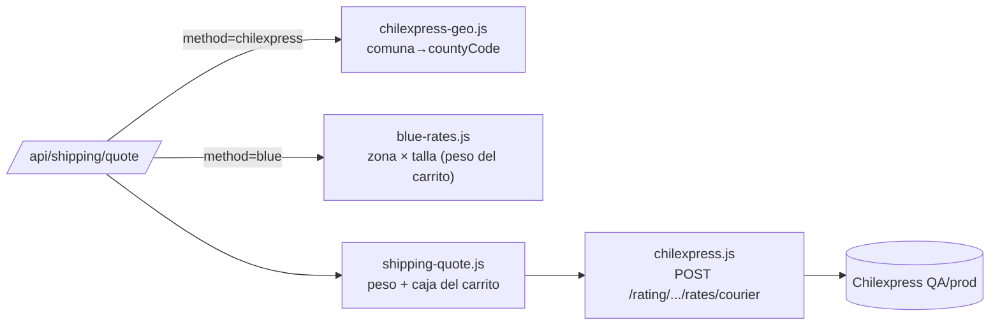

# BlackQuack — Arquitectura y guía técnica

> Documento para auditoría por desarrolladores humanos y por otras IA.
> Describe el stack, la arquitectura, los flujos y las decisiones de diseño del
> ecommerce JAMstack de BlackQuack.

**Estado:** en producción (Cloudflare Pages), validado con venta real de punta a
punta. Barrido de reservas automatizado (Worker cron) y **rate limiting en el edge
sobre `POST /api/checkout` y el webhook `POST /api/flow/confirm`**.
Checkout en página con stepper y **despacho multi-courier**: retiro en Punto Blue
(Blue Express, tarifa de tabla) y despacho a domicilio cotizado en vivo con
Chilexpress, elegibles por ambiente vía `SHIPPING_METHODS` (rama `feat/chilexpress-envio`).

**Última actualización:** 1 agosto 2026 (hora Chile, UTC−04).

> **Registro de cambios (para lectura por otras IA):**
> - **2026-08-01** — **Features de comercio v1 + producto llave en mano.** (1) Motor
>   `js/bq-v5.js` → **`js/storefront.js`** (nombre descriptivo). (2) **Búsqueda con
>   autocompletado** (overlay en el nav + `buscar.html`), client-side sobre el
>   catálogo ya cargado. (3) **Feed de productos** `functions/feed.xml.js` (RSS g:
>   para Google Merchant / Meta); `getCatalog` ahora resuelve `image_url`+`description`.
>   (4) **SEO+** `functions/_middleware.js` inyecta OG/Twitter/canonical/breadcrumb
>   server-side en `/producto?id=` (los scrapers sociales no ejecutan JS). (5) **6
>   páginas legales de Chile + FAQ + `carrito.html`**; footer del engine enlaza las
>   legales. Ver §19. Docs de producto (estrategia llave en mano, tokens, runbook,
>   features) en `docs/producto/`.
> - **2026-07-31** — **Catálogo cacheado en el edge** (`functions/api/catalog.js`):
>   el storefront leía Contentful directo en cada carga (`cache:'no-store'` en
>   `js/api.js`) → 1 llamada CDA por visita, que escala 1:1 con el tráfico y presiona
>   el cupo Free de **100K llamadas/mes** de Contentful. Ahora `js/api.js` lee de
>   `/api/catalog`, una Function con **caché explícita del edge** (`caches.default`,
>   TTL 5 min) + `cf.cacheEverything`: las llamadas CDA del catálogo quedan
>   **desacopladas del tráfico** (~1/min por colo). Header `x-bq-cache: HIT|MISS`
>   para verificar. **Ídem la config del widget de WhatsApp** (`/api/whatsapp-config`,
>   `js/whatsapp.js`): tras esto el **frontend ya no toca Contentful directo**. Ver §18.
> - **2026-07-29** — **App de Contentful para el stock vivo** (`contentful-stock.html`):
>   barra lateral en la entrada `product` que lee `/api/admin/stock` y ajusta por
>   DELTA (`+ Ingreso` / `− Salida`) vía `/api/admin/stock-adjust`, con confirmación
>   al descontar y motivo al `stock_ledger`. HTML estático servido desde el propio
>   Pages (mismo origen → sin CORS); **backend sin cambios**. Gestión de stock vivo
>   "en un solo lugar" para gente no técnica, sin salir de Contentful. Ver §8.2.
> - **2026-07-27** — **Botón flotante de WhatsApp** configurable 100% desde
>   Contentful (número, mensajes, on/off, horario por días+horas en hora de Chile).
>   `js/whatsapp.js` + content type `whatsappWidget`. Ver §14 y `docs/whatsapp-widget.md`.
> - **2026-07-27** — **SEO: datos estructurados schema.org** (JSON-LD `Product`/`Offer`)
>   inyectados en la PDP con precio (CLP) y disponibilidad desde el stock en vivo. Ver §15.
> - **2026-07-27** — **Página 404 de marca** (`404.html`) con rutas absolutas: Cloudflare
>   Pages la sirve en rutas inexistentes; antes salía sin estilos. Ver §16.
> - **2026-07-27** — **Diagramas de arquitectura** en `docs/arquitectura.drawio`
>   (diagrams.net, 4 pestañas). **Diagnóstico SII** (boleta/factura con SimpleAPI) en
>   `SII-FACTURACION-ELECTRONICA.md` (evaluación, sin implementar).
> - **2026-07-26 11:18** — Rate limiting extendido al webhook de Flow: la regla WAF
>   `BQ throttle checkout` ahora cubre `POST /api/checkout` **y** `POST /api/flow/confirm`
>   (mitiga amplificación/DoS por tokens falsos que forzarían llamadas salientes a Flow).
>   Aplicado en el panel de Cloudflare y **sincronizado** en `scripts/setup-ratelimit.sh`
>   (que además ahora acepta `CF_ZONE_ID` por env para el modelo llave-en-mano).
> - **2026-07-26** — Desacople de marca (preparación fork llave-en-mano): prefijo de
>   orden movido a `functions/_lib/brand.js` (fuente de verdad backend, lee generación
>   y validaciones); bloque `BRAND` en `js/config.js` (frontend). Colores ya estaban
>   en `css/bq-v5.css` (`:root`). Ver §13.
> - **2026-07-26** — Exposición histórica del `secretKey` de producción en `.dev.vars`:
>   **RESUELTA**. Credenciales rotadas y actualizadas; las activas son seguras.

---

## 1. Resumen

BlackQuack es un ecommerce ultraligero para una marca de animación análoga
(catálogo acotado, ~15 productos). El objetivo de diseño es **cero build step en
el frontend** (HTML + Vanilla JS + variables CSS) y **lógica transaccional en el
edge** (Cloudflare Pages Functions).

Tres servicios externos:

| Servicio | Rol |
|---|---|
| **Contentful** (Headless CMS) | Catálogo: productos, variantes, imágenes, textos, stock **inicial**. Lo administra gente no técnica. |
| **Cloudflare D1** (SQLite en el edge) | Verdad del **stock en vivo**: decremento atómico, reservas. |
| **Cloudflare KV** | Registro de órdenes (estado de pago, datos de despacho). |
| **Flow** (pasarela chilena) | Procesa los pagos (Webpay, etc.) vía firma HMAC. |
| **Chilexpress** (API Cotizador) | Cotiza el envío **a domicilio** en vivo (peso + dimensiones + cobertura). |
| **Blue Express** (Punto Blue) | **Retiro en punto**: sin API abierta → tarifa de **tabla** (zona × talla). Directorio de puntos servido desde `/api/bluexpress/puntos`. |

Despacho **multi-courier**, elegible en el checkout y controlado por ambiente
(env `SHIPPING_METHODS`):

- **Retiro en Punto Blue** (Blue Express): el cliente retira en un local cercano;
  tarifa de **tabla** por zona × talla porque Blue no expone API. Es el más
  económico → va **preseleccionado** en el checkout.
- **Despacho a domicilio** (Chilexpress): cotizado **en vivo** (peso + dimensiones + cobertura).

En ambos casos Flow cobra `productos + envío/retiro`; el costo se **recalcula
server-side** antes de cobrar (el navegador nunca lo fija). *(La sucursal, la OT y el
tracking automático de Chilexpress quedan para la fase con cuenta comercial.)*

---

## 2. Stack

- **Frontend:** HTML5 estático + Vanilla JS (sin framework ni bundler) + CSS con
  custom properties. Íconos vía lucide (CDN). Rich Text vía
  `@contentful/rich-text-html-renderer` cargado con `import()` dinámico desde
  esm.sh (no hay paso de compilación).
- **Backend:** Cloudflare **Pages Functions** (runtime Workers) en `functions/`.
- **Datos:** Contentful Delivery API (lectura), Cloudflare **D1** (SQL
  transaccional), Cloudflare **KV** (órdenes).
- **Pagos:** Flow (`flow.cl`), API REST con firma HMAC-SHA256.
- **Envíos:** multi-courier controlado por `SHIPPING_METHODS`.
  - **Chilexpress** API Cotizador (Azure APIM, header `Ocp-Apim-Subscription-Key`),
    llamada server-side desde `functions/_lib/chilexpress.js`.
  - **Blue Express** (retiro en Punto Blue): sin API → tarifa de tabla
    (`functions/_lib/blue-rates.js`) y directorio de puntos (`functions/_lib/puntos.json`,
    2.850 puntos, importado como módulo) servido vía `/api/bluexpress/puntos`.
- **Hosting/CI:** Cloudflare Pages conectado al repo de GitHub; push a `main`
  despliega producción, push a otra rama crea un Preview.

---

## 3. Arquitectura de alto nivel



El **barrido de reservas** ya no vive en Pages Functions: corre en un Worker
independiente con Cron Trigger (`worker-cron/`, ver §8). El `POST /api/checkout`
está protegido por una regla WAF de rate limiting que corta antes de la Function.
El **checkout es una página** (`checkout.html`, stepper de 3 pasos) que descubre los
couriers habilitados con `/api/shipping/methods`, cotiza el envío/retiro con
`/api/shipping/quote` y luego cobra en `/api/checkout` (ver §6.6). Para el retiro en
Punto Blue lista los puntos de la comuna con `/api/bluexpress/puntos` (ver §6.7).

**Principio clave:** el navegador nunca calcula precios ni ve el `secretKey` de
Flow. El precio se **recalcula en el servidor** contra Contentful, y la firma
HMAC se hace **server-side**. El frontend solo envía `{id, talla/color/diseño,
qty}` + datos de despacho.

---

## 4. Estructura del repositorio

```
├── index.html, tienda.html, producto.html, talleres.html,
│   nosotros.html, labs.html, contacto.html, gracias.html   # páginas públicas
├── checkout.html                                           # página de pago (stepper 3 pasos)
├── admin.html                                              # panel admin (no enlazado)
├── css/bq-v5.css                                           # todo el CSS (design system)
├── js/
│   ├── config.js        # window.BQ_CONFIG (space id + CDA token públicos)
│   ├── api.js           # fetchProducts(): Contentful → objetos + Rich Text→HTML
│   ├── bq-v5.js         # chrome (nav/footer/cart), PLP, PDP, carrito por SKU, showcase
│   ├── checkout-page.js # app del checkout: stepper, validación, cotización y pago
│   └── checkout.js      # modal de despacho LEGADO (sin uso; reemplazado por la página)
├── functions/                                              # Cloudflare Pages Functions
│   ├── _lib/
│   │   ├── flow.js      # firma HMAC, flowPost/flowGet, flowBase (sandbox/prod)
│   │   ├── catalog.js   # getCatalog() (incl. peso/dimensiones), priceCart(), buildSubject()
│   │   ├── stock.js     # D1: variantKey, lazySeed, reserve/release/commit, resync
│   │   ├── sweep-core.js # lógica del barrido de reservas (la usan /api/admin/sweep y el Worker cron)
│   │   ├── chilexpress.js         # cliente API Cotizador (filtra devoluciones, toma el más barato)
│   │   ├── chilexpress-geo.js     # origen (env) + aliases + comuna→countyCode
│   │   ├── chilexpress-coverage-data.js # GENERADO: mapa comuna→countyCode (339/346)
│   │   ├── shipping-quote.js      # peso+caja del carrito + cotización (lo usan quote y checkout)
│   │   ├── shipping-methods.js    # métodos de despacho habilitados por ambiente (SHIPPING_METHODS)
│   │   ├── blue-rates.js          # tarifa retiro Punto Blue: tabla zona × talla (Prog. Emprendedor)
│   │   ├── blue-puntos.js         # consulta de puntos (filtro comuna/región/cercanía) sobre puntos.json
│   │   ├── puntos.json            # directorio Blue Express (2.850 puntos, ~11 MB; import como módulo)
│   │   ├── shipping.js  # validación RUT (mód. 11), teléfono, comuna, dirección/punto de retiro
│   │   └── comunas.js   # 16 regiones · 346 comunas (fuente de verdad server)
│   └── api/
│       ├── stock.js            # GET  /api/stock?product=ID
│       ├── comunas.js          # GET  /api/comunas
│       ├── shipping/methods.js # GET  /api/shipping/methods  (couriers habilitados)
│       ├── shipping/quote.js   # POST /api/shipping/quote  (cotiza domicilio o retiro)
│       ├── bluexpress/puntos.js # GET  /api/bluexpress/puntos  (puntos Blue filtrados)
│       ├── checkout.js         # POST /api/checkout  (reserva + envío + crea pago Flow)
│       ├── admin/stock.js        # GET  /api/admin/stock  (visor inventario en vivo + seed)
│       ├── admin/stock-adjust.js # POST /api/admin/stock-adjust  (restock/merma por delta, seguro)
│       ├── flow/confirm.js   # POST /api/flow/confirm  (webhook: fuente de verdad del pago)
│       ├── flow/return.js    # POST /api/flow/return   (aterrizaje del navegador)
│       └── admin/
│           ├── resync-stock.js # POST /api/admin/resync-stock  (reabastecer D1 desde Contentful)
│           └── sweep.js        # POST /api/admin/sweep         (disparo manual del barrido)
├── worker-cron/         # Worker aparte con Cron Trigger (barrido automático cada 20 min)
│   ├── src/index.js     # scheduled() → sweep-core sobre los mismos D1/KV
│   ├── wrangler.toml    # crons, bindings D1/KV por ID, observability
│   └── README.md        # deploy y operación del Worker
├── scripts/
│   ├── setup-ratelimit.sh          # crea/actualiza (idempotente) la regla WAF de rate limiting
│   ├── fetch-chilexpress-coverage.mjs # genera chilexpress-coverage-data.js desde la API Cobertura
│   └── test-chilexpress-quote.mjs   # prueba aislada del Cotizador desde Node
├── schema.sql           # DDL de D1 (tablas stock, stock_ledger)
├── seed.sql             # siembra de ejemplo (opcional; el lazy-seed la reemplaza)
├── wrangler.toml        # binding D1 para local/CLI (producción se ata en el panel; gitignored en la raíz)
├── .dev.vars            # secretos LOCALES (gitignored) — SIEMPRE sandbox
├── .dev.vars.example    # plantilla versionada (sin valores)
└── .gitignore
```

---

## 5. Modelo de datos

### 5.1 Contentful (catálogo + stock inicial)

Content type **`product`** (campo `id` es el displayField, ej. `BQ-001`):

| Campo (ID real) | Tipo | Notas |
|---|---|---|
| `id` | Symbol | SKU visible, ej. `BQ-002` |
| `product_title` | Symbol | |
| `descripcin` | Text | **Sin tilde** — Contentful la quitó al autogenerar el ID |
| `category` | Symbol | |
| `price` | Integer | CLP entero; precio del producto simple / fallback |
| `stock` | Integer | Stock inicial **global** (productos simples) |
| `peso_gramos` | Integer | Peso del producto (g), para cotizar el envío. Si falta → default 500 g |
| `alto_cm`, `ancho_cm`, `largo_cm` | Integer | Dimensiones (cm) del paquete; si faltan → caja por defecto |
| `image`, `image_views` | Asset / Array | Imágenes; redimensionadas con la Images API |
| `variants` | Array→Link | Referencias a `productVariant` |
| `details` | RichText | Bloque "detalles" → se renderiza a HTML |

Content type **`productVariant`**:

| Campo | Tipo | Notas |
|---|---|---|
| `size`, `color`, `design` | Symbol | Ejes de variación (opcionales) |
| `stock` | Integer | Stock **inicial** de la variante |
| `price` | Integer | Precio por variante (cae al del producto si falta) |

### 5.2 Cloudflare D1 (`blackquack-stock`) — stock en vivo

Ver `schema.sql`:

```sql
CREATE TABLE stock (
  product_id  TEXT NOT NULL,
  variant_key TEXT NOT NULL DEFAULT '',   -- '' = producto sin variantes
  size, color, design TEXT,               -- display
  qty         INTEGER NOT NULL DEFAULT 0 CHECK (qty >= 0),
  seeded_from TEXT, updated_at TEXT,
  PRIMARY KEY (product_id, variant_key)
);
CREATE TABLE stock_ledger (               -- bitácora de movimientos
  id INTEGER PRIMARY KEY AUTOINCREMENT,
  product_id, variant_key TEXT,
  delta INTEGER, reason TEXT,             -- seed|reserve|release|commit|restock
  ref TEXT, created_at TEXT               -- ref = commerceOrder
);
```

**`variant_key`** es la clave canónica de la variante, construida idéntica en el
cliente (`js/bq-v5.js`) y el servidor (`functions/_lib/stock.js`):
`size:m|color:negro|design:x` (orden fijo, normalizado sin tildes/minúsculas).
Producto simple → `''`. El SKU efectivo es `(product_id, variant_key)`.

### 5.3 Cloudflare KV (`ORDERS_KV`) — órdenes

Clave `order:<flowToken>` → JSON:

```jsonc
{
  "commerceOrder": "BQ-XXXX", "flowOrder": 123, "email": "...",
  "amount": 17980,                 // total cobrado por Flow (productos + envío)
  "amount_products": 13990,        // desglose: productos
  "amount_shipping": 3990,         // desglose: envío cotizado
  "lines": [{ "id","key","qty","unit_price", ... }],
  "courier": "chilexpress",        // normalizado: "chilexpress" | "blue" (para tracking)
  "shipping": { "nombre","rut","telefono","comuna","region",
                // domicilio (Chilexpress):
                "direccion","courier":"Chilexpress","metodo":"domicilio",
                "modalidad":"Despacho a domicilio","costo":3990,"servicio":"EXPRESS" },
  // retiro (Blue Express) reemplaza direccion/servicio por:
  //   "punto":"Punto Blue Express Olivo — Federico Errázuriz 1052, ...","puntoId":"4068",
  //   "courier":"Blue Express","metodo":"retiro_punto","servicio":"Punto Blue"
  "status": "pending|paid|rejected|canceled|abandoned",
  "stock_state": "reserved|committed|released",   // idempotencia del stock
  "created_at": "...", "confirmed_at": "..."
}
```

---

## 6. Flujos principales

### 6.1 Render del catálogo (frontend)

`js/api.js` → `fetchProducts()` pega a la Contentful Delivery API con
`include=2` (resuelve `variants` y assets en una llamada), mapea a objetos
planos, redimensiona imágenes (webp) y convierte el Rich Text `details` a HTML.
`js/bq-v5.js` normaliza y renderiza PLP (grilla) y PDP (galería + panel sticky +
acordeón de detalles). Fallback a `products.json` si Contentful falla.

### 6.2 Stock híbrido (Contentful → D1) con lazy-seed



**Contentful = stock inicial. D1 = stock en vivo.** Una vez sembrado un SKU, D1
es la verdad; editar el stock en Contentful **no** se refleja solo → se
reabastece con `/api/admin/resync-stock` (ver §8).

### 6.3 Checkout y pago (el corazón)



Puntos críticos:
- **Reserva atómica antes de crear el pago:** `UPDATE stock SET qty=qty-n WHERE
  qty>=n` — dos compras simultáneas de la última unidad no pueden ganar ambas
  (la segunda afecta 0 filas → 409). Esto **impide la sobreventa**.
- Si Flow falla tras reservar → se **libera** la reserva (compensación).
- El precio del carrito **y el envío** se recalculan server-side; el cliente nunca
  los fija (el costo mostrado en el paso 2 es solo UX).
- Sin cobertura Chilexpress → se libera la reserva y se rechaza (no se cobra).
- Si el Cotizador falla → **tarifa de respaldo** (`FALLBACK_SHIPPING`) para no
  perder la venta; se registra en logs para conciliar.
- `timeout: 3600` en la orden Flow hace determinista el abandono (ver sweeper).

### 6.4 Confirmación del pago (webhook) — fuente de verdad

```mermaid
sequenceDiagram
  participant F as Flow
  participant CN as /api/flow/confirm
  participant D1 as D1
  participant KV as KV
  F->>CN: POST {token}   (servidor-a-servidor)
  CN->>F: payment/getStatus(token)   (el token NO es prueba de pago)
  alt status = PAGADA (2)
    CN->>D1: commitCart (deja rastro; el stock ya se descontó al reservar)
    CN->>KV: order.stock_state = 'committed', status='paid'
  else RECHAZADA/ANULADA (3/4)
    CN->>D1: releaseCart (devuelve el stock)
    CN->>KV: order.stock_state = 'released'
  end
  CN-->>F: 200 (si falla → 500 para que Flow reintente)
```

- `confirm` es la **fuente de verdad** del pedido (corre aunque el cliente cierre
  el navegador). `return` (`/api/flow/return`) es solo presentación: Flow hace
  **POST** al navegador → responde **303** a `gracias.html?status=...`.
- Idempotencia vía `stock_state` (solo transiciona desde `reserved`).

### 6.5 Estados del stock (máquina)

```
reserved --(pago OK)--> committed
reserved --(rechazo/anulación/abandono)--> released
```

### 6.6 Checkout en página + despacho multi-courier

El checkout dejó de ser un modal: es la página **`checkout.html`** (app en
`js/checkout-page.js`), un **stepper de 3 pasos** — ① Contacto, ② Envío, ③ Pago —
con resumen del pedido sticky. Lee el carrito de `localStorage` (`bq_cart_v5`) y el
catálogo con `fetchProducts()`; el botón "Finalizar compra" del carrito navega a
`checkout.html`. El modal viejo (`js/checkout.js`) queda como legado sin uso.

**Selección de courier (paso 2):** al entrar, el checkout pide los métodos
habilitados con `GET /api/shipping/methods` (según `SHIPPING_METHODS` del ambiente).
Con **uno solo** va directo; con **dos o más** muestra el selector:

- **Retiro en Punto Blue** va **preseleccionado** y marcado "Más barato".
- Se piden **solo los campos del courier elegido**: retiro → selector de Punto Blue
  (Región → Comuna → lista de puntos, ver §6.7); domicilio → dirección (calle + número).
- Cambiar de courier o de comuna **re-cotiza** y resetea lo que ya no aplica.

**Cotización:** al elegir comuna, el navegador llama
`POST /api/shipping/quote {method, comuna, items}`. El endpoint bifurca por courier:
Blue resuelve la tarifa desde la **tabla** (§6.7); Chilexpress cotiza **en vivo**:



- **`chilexpress-geo.js`** traduce la comuna a su `countyCode` de 4 letras (mapa
  generado en `chilexpress-coverage-data.js`; el origen sale del env
  `CHX_ORIGIN_COMUNA`, hoy Quilpué). 2 comunas sin cobertura: San Fabián, O'Higgins.
- **`shipping-quote.js`** suma `peso_gramos × qty` y arma la caja (máx de las
  dimensiones de los productos, o caja por defecto). `computeShipping()` es el helper
  compartido por `quote` y `checkout` → la cotización es idéntica en ambos.
- **`chilexpress.js`** llama al Cotizador, **filtra los servicios de devolución**
  (cod 14/47) y devuelve el **más barato** de los de ida (2/3/4/5/41/42).
- El costo se muestra y se suma al total; `/api/checkout` lo **recotiza** antes de
  cobrar (nunca confía en el navegador).

**Ambientes Chilexpress:** `CHX_SANDBOX` elige el host (`≠0` = QA `testservices`,
`0` = prod `services`); la llave `CHX_RATING_KEY` debe ser **del mismo ambiente**.
Hoy solo hay llaves QA (precios representativos, no reales); producción requiere
cuenta comercial + credenciales prod (ticket en curso).

### 6.7 Retiro en Punto Blue (Blue Express)

Blue Express **no expone un API abierto**, así que el retiro se resuelve con datos
propios: una **tabla de tarifas** y un **directorio de puntos** capturado desde
`app.bluex.cl`.

**Tarifa — `functions/_lib/blue-rates.js`.** Se cobra la del programa comercial
**"Emprendedor de Regiones", modalidad Punto a Punto** (retiro→retiro), que es la
más económica y la que corresponde a nuestro flujo. El precio es `BLUE_RATES[zona][talla]`:

- **Talla** por peso del carrito (`cartWeightKg`): XS ≤0.5 kg · S ≤3 · M ≤6 · L ≤16.
- **Zona** de destino desde el origen (Quilpué): `valpo` (misma región), `rm`
  (Santiago), `extremo` (Arica/Parinacota, Tarapacá, Aysén, Magallanes), `otras`
  (resto interregional).

| Zona \ Talla | XS | S | M | L |
|---|---|---|---|---|
| valpo | 1.900 | 2.900 | 3.900 | 4.800 |
| rm | 2.500 | 3.900 | 4.900 | 7.900 |
| otras / extremo | 2.900 | 6.900 | 8.500 | 11.500 |

> ⚠️ Estas tarifas requieren **registrar BlackQuack como comercio en blue.cl** — pendiente
> comercial. `bluePickupRate(comuna, weightKg)` la usan `quote` y `checkout` (idéntico
> en ambos); `/api/checkout` la **recalcula** antes de cobrar.

**Directorio de puntos — `GET /api/bluexpress/puntos`.** El dataset
(`functions/_lib/puntos.json`, 2.850 puntos, ~11 MB) se **importa como módulo**: en
Pages Functions todo lo que vive bajo `functions/` es código, no un asset servible,
así que no se puede `fetch`; el import es la vía nativa (esbuild lo empaqueta, gzip
~0.4 MB). `blue-puntos.js` lo adelgaza una vez por isolate y expone `buscarPuntos()`
con filtros combinables: `comuna`, `comunaId`, `region`, `regionId`, `tipo`, `q`
(texto libre) y `lat/lng` (ordena por cercanía, haversine). **Nunca sirve el JSON
crudo**: sin filtro ni `limit` explícito responde 400 (salvaguarda anti-11 MB).

**Selector en el checkout.** Reemplazó al iframe del mapa de blue.cl por un flujo
más claro: Región → Comuna → **lista visual de puntos** de esa comuna (nombre, tipo
Punto Blue/Copec, dirección, **horario de hoy** y link "Ver en mapa" a Google Maps).
Elegir un punto guarda `punto` (etiqueta) + `puntoId`; `validateShipping` (con
`requirePunto`) exige el punto igual que exige dirección para el domicilio.

---

## 7. Seguridad

| Aspecto | Cómo se maneja |
|---|---|
| **Flow secretKey** | Solo en Cloudflare Secrets (encriptado) y `.dev.vars` local (gitignored). **Nunca** llega al navegador. Toda la firma HMAC es server-side (`functions/_lib/flow.js`). |
| **Firma HMAC** | Params ordenados alfabéticamente, `nombre+valor` sin separador, HMAC-SHA256 hex, `s` excluido del string. Validado contra Flow real (sandbox y prod). |
| **Precio** | Recalculado en el servidor contra Contentful (`priceCart`). El browser no puede adulterarlo. |
| **Costo de envío** | Recotizado server-side en `/api/checkout` (`computeShipping`); el costo que muestra el navegador es solo UX, no se cobra tal cual. |
| **Chilexpress key** | `CHX_RATING_KEY` en Cloudflare Secrets / `.dev.vars` (gitignored). La cotización se llama **server-side** (`chilexpress.js`); la key nunca llega al navegador (Azure APIM + CORS). |
| **Contentful CDA token** | Es de **solo lectura** y público por diseño (viaja al navegador). No es un secreto. |
| **Sobreventa** | Imposible por el `UPDATE ... WHERE qty>=n` atómico de D1. |
| **`FLOW_SANDBOX`** | Obligatoria (`"0"`/`"1"`); si falta, el checkout se **bloquea** en vez de asumir producción. |
| **Endpoints admin** | Protegidos por `ADMIN_RESYNC_SECRET`, **solo** por header `x-admin-secret` (se quitó el `?secret=` de la URL para no filtrarlo en logs), comparación de tiempo constante. |
| **Rate limiting** | Regla WAF (`http_ratelimit`) `BQ throttle checkout` sobre `POST /api/checkout` **y** `POST /api/flow/confirm`: 10 req/10 s por IP → **block** 10 s. Corta en el edge antes de ejecutar la Function/tocar Flow/D1. El webhook `/api/flow/confirm` se incluye porque un atacante podría hacer POST masivos con tokens arbitrarios para forzar llamadas salientes a `payment/getStatus` (amplificación/DoS); la **integridad** del pedido nunca estuvo en riesgo (la verdad es la respuesta firmada de Flow), esto es defensa de disponibilidad/costo. Acción **block** (no challenge): ambos endpoints se llaman server-a-servidor / por `fetch()` y no pueden resolver un challenge. Se aplica con `scripts/setup-ratelimit.sh` (idempotente; acepta `CF_ZONE_ID` por env para forks). |
| **Datos personales** | RUT/dirección/teléfono se guardan en KV, **no** se envían a Flow (Flow solo recibe items + comuna). |

**Puntos de auditoría / mejoras pendientes:**
1. ✅ **RESUELTO (2026-07-26):** el `secretKey` de producción estuvo brevemente en
   `.dev.vars.example` y en el historial de chat durante el desarrollo. Las
   credenciales **ya fueron rotadas y actualizadas** en el panel de Flow; las
   activas son seguras. El `.dev.vars` local no contiene llaves de producción.
2. `ADMIN_RESYNC_SECRET` es autenticación básica; ya se movió a **header-only**
   (sin secreto en la URL). Para más robustez, firmar las requests.
3. El `.dev.vars` local debe permanecer SIEMPRE en sandbox (regla operativa).

---

## 8. Herramientas de administración (`admin.html`, no enlazada)

Protegidas por `ADMIN_RESYNC_SECRET` (header `x-admin-secret`):

- **`/api/admin/stock`** (GET) — **visor de inventario en vivo**. Por cada SKU
  muestra el `qty` de D1 (la verdad) y el `stock` inicial de Contentful para ver
  el desfase. Al cargar hace `lazySeed` (idempotente) de todos los SKU, así las
  variantes nuevas quedan materializadas en D1.
- **`/api/admin/stock-adjust`** (POST `{product, variantKey, delta, motivo}`) —
  **reabastecimiento/merma por DELTA** (`qty = qty + delta`). Es la vía diaria de
  restock desde `admin.html` (pestaña "Inventario"). **Seguro frente a reservas en
  vuelo** porque `qty` ya las refleja (aditivo, no absoluto); el `CHECK (qty >= 0)`
  impide restar de más. Registra `stock_ledger` con reason `adjust` y `ref`=motivo.
- **`/api/admin/resync-stock`** — reabastecimiento autoritativo **ABSOLUTO**: lee
  Contentful en vivo y **machaca** `qty` en D1 (upsert + ledger reason `restock`).
  **Destructivo respecto a reservas en vuelo** → quedó relegado a "Avanzado" en el
  admin, solo para re-alinear D1 a la fuerza; el día a día se hace con el delta de
  arriba, que no tiene ese riesgo.
- **`/api/admin/sweep`** — libera reservas **abandonadas**: recorre las órdenes
  `reserved` vencidas, consulta Flow (`getStatus`) y libera solo las **no
  pagadas** (si Flow dice pagada, hace `commit` como red de seguridad). Comparte
  la lógica con el Worker cron vía `functions/_lib/sweep-core.js` (sin duplicar).
  Este endpoint queda como **disparo manual** ("forzar ahora") desde `admin.html`.

### 8.1 Barrido automático — Worker `blackquack-cron` (`worker-cron/`)

Cloudflare Pages **no tiene cron nativo**, así que el barrido corre en un **Worker
independiente** con Cron Trigger `*/20 * * * *` (cada 20 min, en UTC). Se
despliega y versiona aparte de Pages y **no** afecta el build del sitio:

```bash
cd worker-cron
npx wrangler deploy
npx wrangler secret put FLOW_API_KEY      # mismas llaves de producción que Pages
npx wrangler secret put FLOW_SECRET_KEY
```

- **Comparte los datos con Pages:** los bindings `ORDERS_DB` (D1 `blackquack-stock`)
  y `ORDERS_KV` apuntan por ID a los mismos recursos. `FLOW_SANDBOX="0"` va como
  var en `wrangler.toml`; los secretos NO (se cargan con `wrangler secret put`).
- **Sin URL expuesta:** reemplaza al cron externo; todo queda dentro de Cloudflare.
- **Observability activada** (`observability.logs` en `wrangler.toml`): los
  `console.log('[cron-sweep]', ...)` se persisten en el dashboard (pestaña
  Observability del Worker), sin necesidad de `wrangler tail`.

### 8.2 App de Contentful — stock vivo desde el sidebar (`contentful-stock.html`)

Para gestionar el **stock vivo sin salir de Contentful** (un solo lugar para gente
no técnica), hay una **App de barra lateral** servida como HTML estático **desde el
propio Pages** (`/contentful-stock.html`). Al vivir en el mismo dominio, sus
llamadas a `/api/admin/*` son del **mismo origen** (sin CORS) y **el backend no
cambia**: reutiliza tal cual los endpoints de §8.

- **Qué hace:** en la entrada `product` lee el código (campo `id`), consulta
  `/api/admin/stock?product=<id>` y muestra el stock vivo por SKU (con "inicial" de
  Contentful para ver el desfase). Ajusta por DELTA con `+ Ingreso` / `− Salida`
  llamando a `/api/admin/stock-adjust`.
- **No unifica la base de datos, unifica la pantalla:** D1 sigue siendo la verdad
  atómica del stock; la App es solo una interfaz alternativa a la pestaña
  "Inventario" de `admin.html`, incrustada en el CMS.
- **Salvaguardas:** confirmación nativa (`sdk.dialogs.openConfirm`) **solo al
  descontar**; pre-chequeo de no restar más de lo disponible (el backend igual lo
  blinda con `CHECK (qty >= 0)`); cada ajuste queda en `stock_ledger` con su motivo
  (venta presencial, merma, ingreso a bodega…). Cubre el caso de **ventas fuera de
  la tienda** (descuento manual) además del restock.
- **Secreto fuera del código:** el `adminSecret` viaja por los **parámetros de la
  App** en Contentful (`sdk.parameters.instance`/`installation`), no en el HTML —
  el archivo es inofensivo si se abre suelto. Mismo modelo de confianza que
  `admin.html` (el secreto llega al navegador del operador de confianza).
- **Registro en Contentful:** App custom → Frontend URL
  `https://blackquack.cl/contentful-stock` → location **Entry sidebar** →
  parámetros `adminSecret` (req.), `apiBase` (vacío = mismo origen), `codeField`
  (`id`), `lowThreshold` (`3`) → asignada al content type `product`.

---

## 9. Entorno y despliegue (Cloudflare Pages)

### Variables de entorno (por ámbito: **Production** y **Preview**)

| Variable | Tipo | Production | Preview / local |
|---|---|---|---|
| `FLOW_API_KEY` | Secret | Producción | Sandbox |
| `FLOW_SECRET_KEY` | Secret | Producción | Sandbox |
| `FLOW_SANDBOX` | Plaintext | `0` | `1` |
| `CONTENTFUL_SPACE_ID` | Plaintext | `jsyka3qmf5vm` | igual |
| `CONTENTFUL_ACCESS_TOKEN` | Plaintext | CDA (solo lectura) | igual |
| `CONTENTFUL_ENVIRONMENT` | Plaintext | `master` | igual |
| `ADMIN_RESYNC_SECRET` | Secret | aleatorio | aleatorio |
| `CHX_RATING_KEY` | Secret | prod (pendiente) | QA (bq-cotizador) |
| `CHX_ORIGIN_COMUNA` | Plaintext | `QUILPUE` | `QUILPUE` |
| `CHX_SANDBOX` | Plaintext | `0` (con llave prod) | `1` / ausente (QA) |
| `SHIPPING_METHODS` | Plaintext | `blue_retiro` (o ausente → default) | `blue_retiro,chilexpress_domicilio` |

**Regla de oro (Flow):** `FLOW_SANDBOX=0` va con llaves de **producción**;
`FLOW_SANDBOX=1` con llaves de **sandbox**. Nunca se cruzan (Flow rechaza el
apiKey del ambiente equivocado). La **rama decide el ambiente**: `main` →
Production (dinero real), otras ramas → Preview (sandbox).

**Regla de oro (Chilexpress):** igual criterio — `CHX_SANDBOX` y `CHX_RATING_KEY`
deben ser del **mismo ambiente** (QA testservices ↔ llave QA; prod services ↔ llave
prod). Hoy Production usa `CHX_SANDBOX=1` porque aún no hay llave prod; hasta tenerla
NO se debe mergear a `main` para cobrar precios reales de envío.

**Métodos por ambiente (`SHIPPING_METHODS`):** lista coma-separada que decide qué
couriers ofrece el checkout. Producción sale hoy **solo con `blue_retiro`**
(Chilexpress espera credenciales prod); Preview enciende ambos
(`blue_retiro,chilexpress_domicilio`). Si la variable falta, el default es `blue_retiro`.

### Bindings (panel → Settings → Functions)

- KV namespace: `ORDERS_KV` → tu namespace.
- D1 database: `ORDERS_DB` → `blackquack-stock`.

El `database_id` en `wrangler.toml` es solo para local/CLI; en producción manda
el binding del panel.

### Esquema de D1 en producción (una vez)

```bash
npx wrangler d1 execute blackquack-stock --remote --file=schema.sql
```

El stock se puebla solo (lazy-seed) al leer cada producto por primera vez.

### Ambiente de prueba (Preview) — aislado de producción

Las ramas ≠ `main` despliegan a **Preview**. Para que las pruebas **no toquen datos
reales**, el ambiente Preview usa **recursos separados**:

| Recurso | Producción | Preview |
|---|---|---|
| D1 (`ORDERS_DB`) | `blackquack-stock` | `blackquack-stock-preview` |
| KV (`ORDERS_KV`) | `BLACKQUACK_ORDERS_KV` | `blackquack-orders-preview` |
| Flow | prod (`FLOW_SANDBOX=0`) | sandbox (`FLOW_SANDBOX=1`) |
| Chilexpress | prod (pendiente) | QA (`CHX_SANDBOX=1` / ausente) |

Los bindings de Preview (`ORDERS_KV`, `ORDERS_DB`) apuntan a esos recursos de prueba;
se configuran en Pages → Settings → **Bindings** → ambiente **Preview**. El D1 de
prueba se crea una vez y se le carga `schema.sql` (panel D1 → **Console**, pegando el
DDL; o `wrangler d1 execute blackquack-stock-preview --remote --file=schema.sql`).

**URLs de Preview:** cada deploy tiene una URL **congelada** por hash
(`<hash>.black-cuack-studio.pages.dev`) que muestra SIEMPRE esa versión; la URL de
rama (ej. `feat-chilexpress-envio.black-cuack-studio.pages.dev`) apunta al **último**
deploy. *(Si ves código viejo, estás en una URL de hash antiguo — usa la de rama.)*

**Ventaja sobre local:** el webhook `confirm` de Flow **sí** llega al Preview (URL
pública), así que se prueba el ciclo completo pago→confirmación→commit de stock —
algo que `localhost` no permite. Validado E2E en Preview (orden BQ-1B21D273).

### Datos de prueba (Transbank Webpay — ambiente de integración)

El sandbox de Flow (`FLOW_SANDBOX=1`) lleva a **Webpay de integración**, sin dinero real:

| Resultado | Tarjeta | CVV | Vencimiento |
|---|---|---|---|
| **Aprueba** | VISA `4051 8856 0044 6623` | `123` | cualquier fecha futura |
| **Rechaza** | Mastercard `5186 0595 5959 0568` | `123` | cualquier fecha futura |

Tras ingresar la tarjeta, Webpay pide autenticación del "banco":
**RUT `11.111.111-1`**, **Clave `123`**. *(Recordar: Flow tiene monto mínimo $350 CLP.)*

---

## 10. Desarrollo local

```bash
# .dev.vars con llaves SANDBOX + FLOW_SANDBOX=1
npx wrangler pages dev . --kv ORDERS_KV
# (usa el binding D1 del wrangler.toml; aplica el esquema local si hace falta:)
npx wrangler d1 execute blackquack-stock --local --file=schema.sql
```

La página de checkout (`checkout.html`) necesita las Functions corriendo: cotiza
con `/api/shipping/quote` (requiere `CHX_RATING_KEY` en `.dev.vars`) y lista comunas
con `/api/comunas`. Para probar la cotización desde Node sin levantar el sitio:
`node scripts/test-chilexpress-quote.mjs` (con `CHX_RATING_KEY` exportada).

---

## 11. Limitaciones conocidas / pendientes

1. **Restock:** ~~editar stock en Contentful no se refleja tras el primer seed~~
   **resuelto** con el **ajuste por delta** (`/api/admin/stock-adjust`, pestaña
   "Inventario"): se repone sumando unidades en D1, sin tocar Contentful y sin el
   riesgo del resync absoluto. `resync-stock` queda solo como reset de emergencia.
   *(Extensión futura: un webhook de Contentful reconciliador podría convertir las
   ediciones del CMS en deltas reusando la misma `adjustStock` — sin sobreventa.)*
2. **Sweeper:** ~~requiere un cron externo~~ **resuelto** con el Worker
   `blackquack-cron` (§8.1). Ojo: se despliega **aparte** de Pages — un cambio en
   `worker-cron/` no se publica con el push a `main`; hay que `wrangler deploy`.
3. **Rate limiting:** el **plan gratuito** de Cloudflare solo permite `period=10`
   (no 60) y **exige** `cf.colo.id` junto a `ip.src` en las characteristics. Por
   eso la regla es 10 req/10 s (no 10/min). `setup-ratelimit.sh` ya usa estos
   valores; si algún día se sube de plan, se puede ampliar la ventana.
4. **Productos simples sin `stock` global** en Contentful → aparecen en 0
   (no comprables) hasta que se les asigne stock.
5. **Rich Text** depende de esm.sh en runtime (degradación elegante si falla).
6. El **webhook `confirm`** solo se prueba de verdad desplegado (Flow no alcanza
   `localhost`).
7. **Envío Chilexpress — QA:** hoy solo hay llaves de **prueba (QA)**; los precios
   son representativos pero pueden diferir de los reales. Antes de cobrar envíos
   reales en `main`: conseguir credenciales **prod** + `CHX_SANDBOX=0`. Ticket
   comercial (SR-107752) en curso.
8. **Sucursal, OT y tracking automático** de Chilexpress → fase siguiente; requieren
   cuenta comercial + TCC. El `chilexpress-coverage-data.js` es generado: regenerar
   con `scripts/fetch-chilexpress-coverage.mjs` si Chilexpress cambia su cobertura.
9. **Checkout page** requiere las Functions (no corre en `file://` ni en solo-frontend).
   El modal legado `js/checkout.js` sigue cargado en algunas páginas pero está sin uso.
10. **Blue Express — bloqueador comercial:** las tarifas del programa Emprendedor
    Punto a Punto requieren **registrar BlackQuack como comercio en blue.cl**. Mientras,
    los valores de `blue-rates.js` son los publicados del programa (no una cuenta activa).
    Blue **no tiene API**: no hay generación de OT ni tracking automático; el retiro se
    coordina manualmente con el `puntoId` guardado en la orden.
11. **`puntos.json` (~11 MB) está versionado** y se empaqueta en el bundle (gzip ~0.4 MB,
    holgado). Si el directorio Blue cambia hay que re-capturarlo; si algún día pesa
    demasiado, migrar a KV/R2 en vez del import como módulo.

---

## 12. Cómo auditar rápido

- **¿Se puede sobrevender?** Revisar `reserveLine` en `functions/_lib/stock.js`
  (el `WHERE qty >= ?` es la garantía).
- **¿El precio es manipulable?** Revisar `priceCart` en `functions/_lib/catalog.js`
  (ignora cualquier precio del cliente).
- **¿El envío es manipulable?** Revisar que `/api/checkout` llame `computeShipping`
  (domicilio) o `bluePickupRate` (retiro) y sume ese costo (no el del body); la key
  `CHX_RATING_KEY` no debe aparecer en `js/`. El courier/método se valida contra
  `SHIPPING_METHODS` (`isMethodEnabled`), no se confía en el `method` del navegador.
- **¿El secreto de Flow llega al cliente?** `grep -rn "FLOW_SECRET" js/ *.html`
  debe dar 0 usos reales.
- **¿La firma HMAC es correcta?** `signParams` en `functions/_lib/flow.js`;
  verificable contra Flow con `payment/getStatus` (read-only, no cobra).
- **¿Idempotencia de pagos?** `stock_state` en `flow/confirm.js` (solo actúa
  desde `reserved`).

---

## 13. Marca y modelo "llave en mano" (fork)

Este proyecto es, además del ecommerce de BlackQuack, una **base para forkear** y
entregar tiendas a otros clientes. Las constantes de marca están **desacopladas de
la lógica**, repartidas en tres puntos según el runtime (no hay build step que los
una, por diseño "cero build step" del frontend). Al forkear se ajustan en paralelo:

| # | Qué | Dónde | Cubre |
|---|---|---|---|
| 1 | **Backend** | `functions/_lib/brand.js` | `orderPrefix` (prefijo del N° de orden) + `name`. La generación (`newOrderCode`) y las validaciones (`ORDER_CODE_RE` en `checkout.js`, `admin/dispatch.js`, `order/status.js`) leen de aquí. |
| 2 | **Frontend (JS)** | `js/config.js` → `window.BQ_CONFIG.BRAND` | Nombre, tagline, email, redes. Lo que consume el JS del navegador. |
| 3 | **Colores** | `css/bq-v5.css` (`:root`) | `--color-brand`, `--color-accent`, etc. Ya estaba centralizado. |
| 4 | **Infra WAF** | `scripts/setup-ratelimit.sh` | Rate limiting; `export CF_ZONE_ID=...` apunta a la zona del cliente. |

**Límites honestos (no sobrevender la "flexibilidad"):**

- **Texto estático del HTML** (títulos `<title>`, footer, copy en `nosotros.html`,
  etc.) **no** se lee desde config: por el "cero build step", se cambia con un
  **find/replace** al forkear. Centralizarlo exigiría un build step o inyección JS
  en runtime (flash de contenido), ambos contrarios al principio de diseño.
- **SKU (`BQ-001`, …) NO son constantes de código**: viven en **Contentful** (los
  define cada cliente en su catálogo). No se tocan aquí.
- **Nombres de tablas D1** (`blackquack-stock`, etc.) son **internos**; un fork los
  conserva idénticos. Rebautizarlos no aporta y agrega riesgo.
- **Stack Chile-only**: pagos (**Flow**) y couriers (**Chilexpress**, **Blue
  Express**) son chilenos. La moneda efectiva es **CLP**; esto es un "llave en mano
  para PYMEs chilenas", no un ecommerce multi-país. Cambiar de país implica
  reescribir pagos y despacho, no solo config.

**Checklist mínimo de fork:** `brand.js` (prefijo+nombre) · `js/config.js` (BRAND) ·
`css/bq-v5.css` (colores) · logo en `images/` · find/replace del nombre en HTML ·
`CF_ZONE_ID` + `setup-ratelimit.sh` · secrets de Flow/Chilexpress del cliente.

---

## 14. Botón flotante de WhatsApp (configurable desde Contentful)

`js/whatsapp.js` — widget autocontenido (inyecta su propio CSS + DOM) incluido en
las páginas públicas (no en `checkout` ni `admin`). Lee **una** entrada del content
type `whatsappWidget` en Contentful; **todo** se controla desde el CMS, sin tocar
código:

| Campo (Contentful) | Efecto |
|---|---|
| `activo` (Boolean) | Interruptor maestro mostrar/ocultar |
| `telefono` | Número con código país sin `+` (ej. `56912345678`) |
| `mensajePredeterminado` | Texto pre-rellenado en el chat |
| `saludo` | Burbuja de saludo (opcional) |
| `diasDisponibles` (lista) | Días disponibles (`lunes`…`domingo`, con/sin tilde) |
| `horaInicio` / `horaFin` | Ventana horaria `HH:MM` |
| `ocultarFueraDeHorario` | `true`: oculta fuera de horario · `false`: muestra en gris |
| `mensajeFueraDeHorario` | Texto alterno fuera de horario |

- **Horario evaluado en hora de Chile** (`America/Santiago`), no la del visitante.
  Dentro de horario → verde con punto "en línea"; fuera → gris (o oculto).
- Caché de 5 min en `sessionStorage`; **falla en silencio** si Contentful no
  responde. No pinta nada hasta que exista el content type + entrada publicada.
- Detalle de operación y modelo exacto en `docs/whatsapp-widget.md`.
- **Limitación:** una sola ventana horaria para todos los días (sin horarios por
  día ni corte de colación).

## 15. SEO — datos estructurados schema.org (JSON-LD)

La PDP inyecta un `<script type="application/ld+json">` con un `Product` para rich
snippets de Google (`injectProductSchema` en `js/bq-v5.js`):

- `name`, `image` (descarta el placeholder), `description` (texto plano), `sku`,
  `brand`.
- `Offer` con `priceCurrency: CLP` y `price`; **`AggregateOffer`** (`lowPrice`/
  `highPrice`/`offerCount`) cuando las variantes tienen distinto precio.
- `availability` (`InStock`/`OutOfStock`) calculada desde el **stock EN VIVO** (D1)
  → se inyecta tras `/api/stock`. `itemCondition: NewCondition` + URL canónica.
- Se inserta **por JS** (la PDP se renderiza en el cliente; Googlebot ejecuta JS).
  Un render server-side sería más robusto pero excede el diseño "cero build step".
- Validar con Rich Results Test usando la **URL** (no pegando el código, porque es
  dinámico).

## 16. Página 404

`404.html` en la raíz — Cloudflare Pages la sirve automáticamente (status 404) en
cualquier ruta inexistente, **conservando la URL pedida**. Por eso usa **rutas
absolutas** (`/css/…`, `/images/…`): antes, una URL profunda inexistente resolvía
los assets relativos contra el path pedido y la página salía sin estilos.
Autocontenida (no depende del header/nav por JS) y de marca.

## 17. Diagramas y diagnósticos (docs/)

- `docs/arquitectura.drawio` — diagramas editables en diagrams.net (4 pestañas:
  sistema, checkout+pago, datos/stock, despliegue).
- `SII-FACTURACION-ELECTRONICA.md` — diagnóstico (sin implementar) de emitir
  boleta/factura electrónica vía SimpleAPI: viabilidad, prerrequisitos tributarios,
  encaje en `flow/confirm.js` con `dte_state` idempotente. Decisión: arrancar por
  boleta; factura en fase 2.

---

## 18. Postura de plan Free y catálogo cacheado en el edge

Objetivo de diseño: **mantener la infraestructura en los planes gratuitos el mayor
tiempo posible**, incluso con publicidad. Los límites reales y quién los toca:

| Recurso | Sirve | Límite Free | Riesgo |
|---|---|---|---|
| **Cloudflare Pages** | HTML/JS/CSS, **el video de fondo**, estáticos | ancho de banda **ilimitado** | ninguno |
| **Contentful — asset bandwidth** | fotos de producto | 50 GB/mes | bajo (ya WebP) |
| **Contentful — API calls** | JSON del catálogo + config del widget | **100K/mes** (CMA+CDA+CPA+GraphQL) | el que hay que cuidar |

Notas clave para un auditor:
- **El video pesado NO cuenta** contra ningún cupo: lo sirve Pages (banda ilimitada).
- **Las imágenes ya salen WebP redimensionadas** por la Images API de Contentful
  (`js/api.js` → `IMG = { main:'fm=webp&q=80&w=1200…', view:'fm=webp&q=75&w=900' }`).
  Sin eso, los originales de ~23 MB harían injugable la tienda. El uso de banda es
  marginal (decenas de MB).
- **El grueso del uso de API suele ser CMA** (edición humana en Contentful: modelar
  content types, editar entradas, la app de stock del sidebar). Es costo de *setup*,
  acotado por el trabajo manual, no por el tráfico. No se optimiza: es uso legítimo.

### 18.1 `/api/catalog` — proxy del catálogo cacheado en el edge

El único consumo de **CDA que escalaba 1:1 con el tráfico** era el storefront: antes
`js/api.js` leía `cdn.contentful.com` directo con `cache:'no-store'` → **1 llamada
CDA por visita**. Con publicidad, eso apuntaba al cupo de 100K.

Solución (`functions/api/catalog.js`): el frontend lee de **`/api/catalog`**, una
Pages Function que proxya la CDA con **dos capas de caché**:
1. **Cache API del edge** (`caches.default`, TTL 5 min): en un HIT la Function
   retorna **sin llamar a Contentful**. Observable por `x-bq-cache: HIT|MISS`.
2. **`cf.cacheEverything`** sobre la subrequest a Contentful: segunda red si la
   Cache API está fría en ese colo.

Devuelve el **JSON crudo de la CDA** (items + `includes.Asset` + `includes.Entry`),
así `js/api.js` conserva su mapeo (WebP, variantes, rich text) **sin cambios**. La
respuesta de la CDA no incluye el token → seguro reenviarla.

Efecto: las llamadas CDA del catálogo quedan **desacopladas del tráfico** (~1 por
minuto por colo, no 1 por visita). El **stock EN VIVO no pasa por acá**: va por
`/api/stock` (D1) con su propia caché de 15 s, así el TTL de 5 min del catálogo no
afecta la frescura del inventario. Un cambio de **precio/texto** en Contentful tarda
hasta 5 min en verse (aceptable; subir/bajar `TTL` en la Function lo ajusta).

### 18.2 `/api/whatsapp-config` — config del widget cacheada en el edge

Mismo patrón que §18.1, para el otro consumo que escalaba con el tráfico. Antes
`js/whatsapp.js` leía Contentful directo: su caché en `sessionStorage` (5 min) evita
repetir el request **durante la navegación**, pero un **visitante nuevo** (caché
vacía) disparaba **1 llamada CDA** — o sea, ~1 por visitante único, uno de los dos
techos del plan Free a escala de publicidad.

Solución (`functions/api/whatsapp-config.js`): `js/whatsapp.js` lee de
**`/api/whatsapp-config`**, una Function con la misma doble caché del edge
(`caches.default` TTL 5 min + `cf.cacheEverything`, header `x-bq-cache`). Ahora el
visitante nuevo también sale del edge, no del cupo.

**Resultado global:** el **frontend ya no toca Contentful directamente** — catálogo y
config del widget van por Functions cacheadas en el edge, así que el consumo de API
de Contentful queda **desacoplado del tráfico** (~1 llamada por minuto por colo por
recurso). El token CDA de `js/config.js` quedó **vestigial** (de solo lectura y
público por diseño; ya nadie lo usa en el navegador — solo se mantiene el bloque
`BRAND` de ese archivo). El **primer techo** del plan Free pasa a ser la **banda de
imágenes** (~0,55 MB por visita nueva → ~90K visitas únicas/mes); si algún día se
supera, la siguiente palanca es proxyear/cachear las imágenes por Cloudflare.

---

## 19. Features de comercio (búsqueda, feed, SEO) y páginas base

Features del boilerplate agregadas en la v1 (viven en el motor/Functions → van con
la plantilla para toda la flota). El menú completo y el roadmap están en
`docs/producto/FEATURES-V1.md`.

- **Búsqueda con autocompletado** (`js/storefront.js`): el catálogo ya está en el
  navegador (`PRODUCTS`), así que buscar es un filtro en memoria — instantáneo, sin
  backend. Overlay inyectado por el engine (ícono 🔍 del nav) + página `buscar.html?q=`
  con filtrado en vivo. Ranking simple (nombre > categoría > descripción), normaliza tildes.
- **Feed de productos** (`functions/feed.xml.js` → `/feed.xml`): mismo patrón que
  `sitemap.xml.js`; emite el catálogo en RSS 2.0 (namespace `g:`) para **Google
  Merchant Center** y **Meta Commerce Manager**. Disponibilidad desde el stock D1 en
  una consulta; cacheado 1 h. `getCatalog` (`_lib/catalog.js`) ahora resuelve
  `image_url` (Assets de Contentful) y `description`, campos que el feed exige.
- **SEO+** (`functions/_middleware.js`): la PDP se arma client-side, pero los
  scrapers sociales (WhatsApp/FB/Twitter) **no ejecutan JS**. Este middleware inyecta
  **server-side** Open Graph / Twitter Card / canonical / breadcrumb (JSON-LD) en el
  `<head>` de `/producto(.html)?id=`, leyendo el catálogo cacheado, con **HTMLRewriter**.
  **Defensivo:** solo toca esa ruta con `?id` y HTML; ante cualquier error devuelve la
  respuesta intacta → no afecta `/api` ni el resto (verificado en producción).
- **Páginas base y legales** (Chile): `carrito.html` (carrito de página completa que
  reusa `renderCartPage()` del engine sobre el mismo `bq_cart_v5`), `buscar.html`,
  `preguntas-frecuentes.html`, y las **6 legales** (`terminos`, `privacidad`,
  `despacho`, `cambios-devoluciones`, `anulacion` —botón de arrepentimiento, Ley
  21.398—, `cookies`), enlazadas desde el footer del engine. Son **plantillas** con
  placeholders `[ENTRE CORCHETES]` a completar por cliente; **requieren revisión legal**.
  El "pago rechazado" no es página aparte: lo maneja `gracias.html?status=rejected`.

> **Pendiente / próximos pasos (roadmap v1, en `docs/producto/FEATURES-V1.md`):**
> - **Cupones / códigos de descuento** — Contentful (definiciones) + D1 (límite de
>   usos atómico), validados en `/api/checkout`. *(no implementado)*
> - **Email transaccional** (Resend) — confirmación de compra / estado / tracking;
>   luego campañas acotadas con opt-in. *(no implementado)*
> - **Analítica** — Cloudflare Web Analytics + mini-dashboard nuevo en el admin
>   (lee KV+D1). *(no implementado)*
> - **Extracción del repo plantilla:** neutralizar identificadores heredados
>   (`bq-v5.css`, `SHOP_CONFIG`/`BQ_CONFIG`, `x-bq-cache`, `bq_cart_v5`), wiring del
>   token loader (runtime) en todas las páginas, y automatizar el aprovisionamiento
>   (ver `docs/producto/RUNBOOK-APROVISIONAMIENTO.md`).
> - **Rellenar placeholders legales** con los datos reales del comercio + revisión legal.
> - Paginar el catálogo para soportar >100 productos (`limit=100` actual).
